# Exercise 4 - Lake Databases and Database templates

In this exercise you will explore the concept of a lake database and you will learn how to use readily available database templates for lake databases.

The lake database in Azure Synapse Analytics enables you to bring together database design, meta information about the data that is stored and a possibility to describe how and where the data should be stored. Lake database addresses the challenge of today's data lakes where it is hard to understand how data is structured.

The tasks you will perform in this exercise are:

- Exercise 4 - Lake Databases and Database templates
  - Task 1 - Create and configure a lake database
  - Task 2 - Create a lake database table from data lake storage
  - Task 3 - Create a custom lake database table and map data into it
  - Task 4 - Create a complex lake database using database templates

## Task 1 - Create and configure a lake database

In this task you will create a new lake database.

1. In Synapse Studio, navigate to the `Data` hub, select the `Workspace` section and then select `+` followed by `Lake database (preview)` to trigger the creation of a new lake database.

   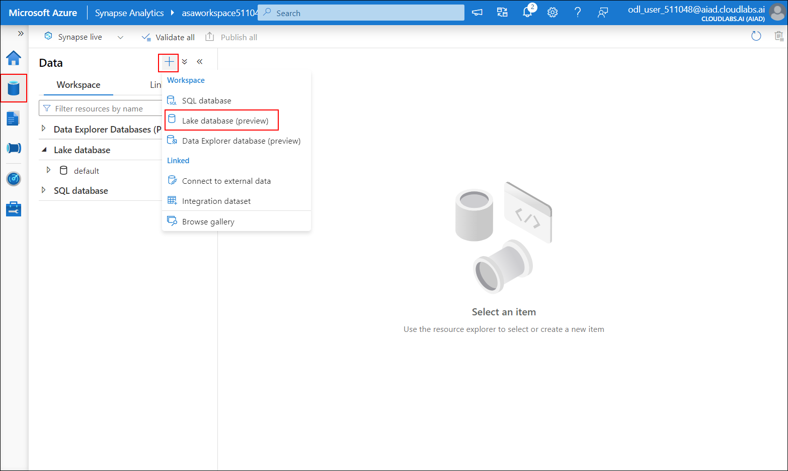

2. Configure the properties of the lake database as follows:

     - Name: `Database1`
     - Input folder: `database1/`
     - Data format: `Parquet`

    Select `Publish` to publish the new lake database.

    

## Task 2 - Create a lake database table from data lake storage

In this task you will create a new lake database table using files from the data lake storage account.

1. In Synapse Studio, navigate to the `Data` hub and select the data lake account under `Linked`, `Azure Data Lake Storage Gen2`. Select the `database1` file system, and then select the `fact-sale` folder, followed by the `Day=20191201` folder. In this folder, locate the `sale-small-20191201-snappy.parquet` file.

   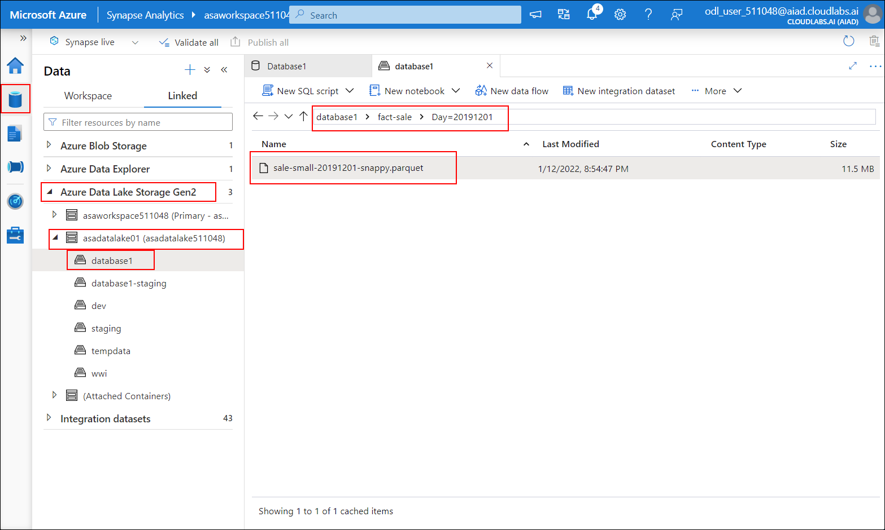

2. In Synapse Studio, navigate to the `Data` hub, and select the `Workspace` section followed by `Lake database`. In the context menu associated with the `Database1` database, select `Open` to edit the lake database.

    In the database editor, select `+ Table` followed by `From data lake`.

   

3. Configure the properties of the new table as follows, then select `Continue`:

    - External table name: `FactSale`
    - Linked service: `asadatalake01`
    - Input file or folder: `database1/fact-sale`

   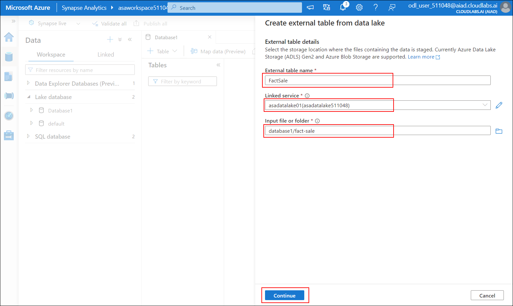

3. Select `Preview Data`.

   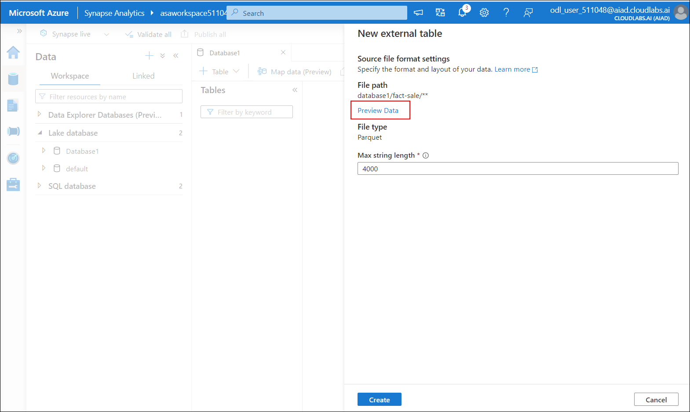

4. Observe the data preview, then select **OK** followed by `Create` to finalize the process.

   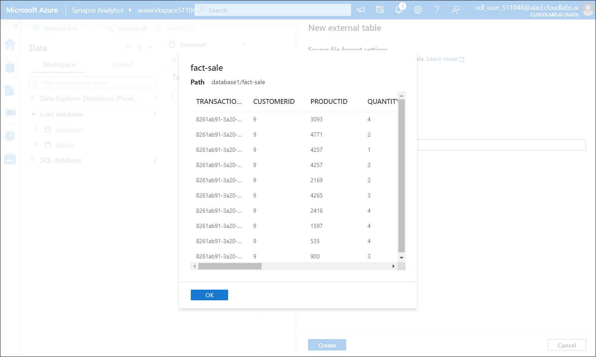

5. In the table designer, select `Columns`, followed by `+ Column` and `Partition column`.

   

6. Use `Day` as the name of the partition column and `integer` as data type. Select `Publish` to publish the new table.

   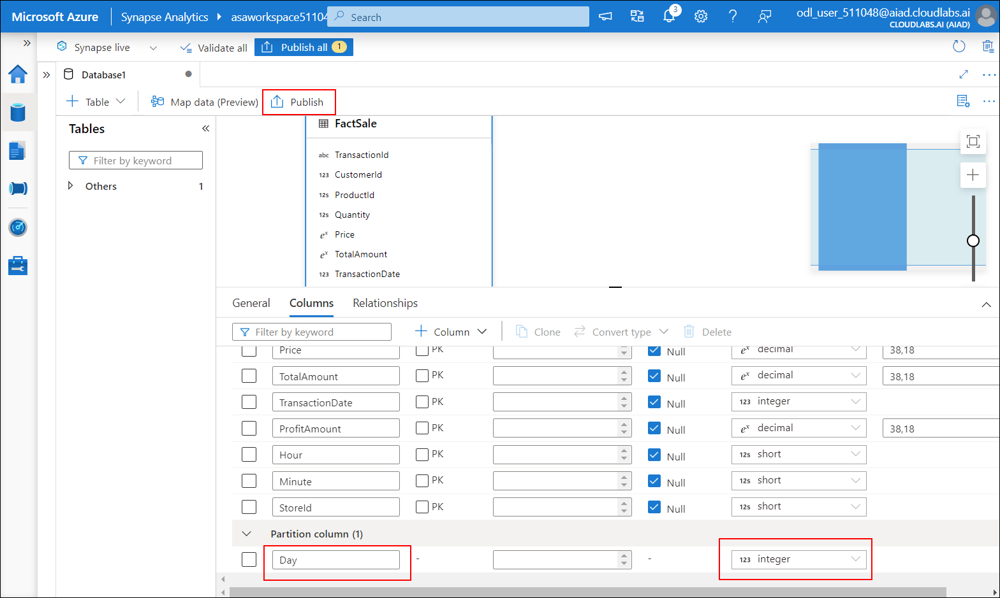

7. In Synapse Studio, navigate to the `Develop` hub and create a new SQL script. Make sure the `Built-in` serverless SQL pool is selected as well as the `Database1` database.

    Set the content of the script to the statement below and run the script.

    ```sql
    SELECT COUNT(*) FROM FactSale
    ```

   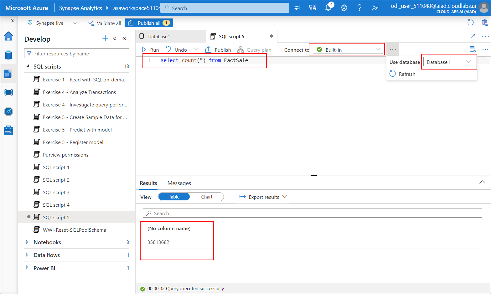

## Task 3 - Create a manual lake database table and map data into it

In this task you will create manually a new lake database table and map data into it from the data lake storage account.

1. In Synapse Studio, navigate to the `Data` hub, and select the `Workspace` section followed by `Lake database`. In the context menu associated with the `Database1` database, select `Open` to edit the lake database.

   > **Note**: If you are not able to see `Database1`, refresh the page and try again.

   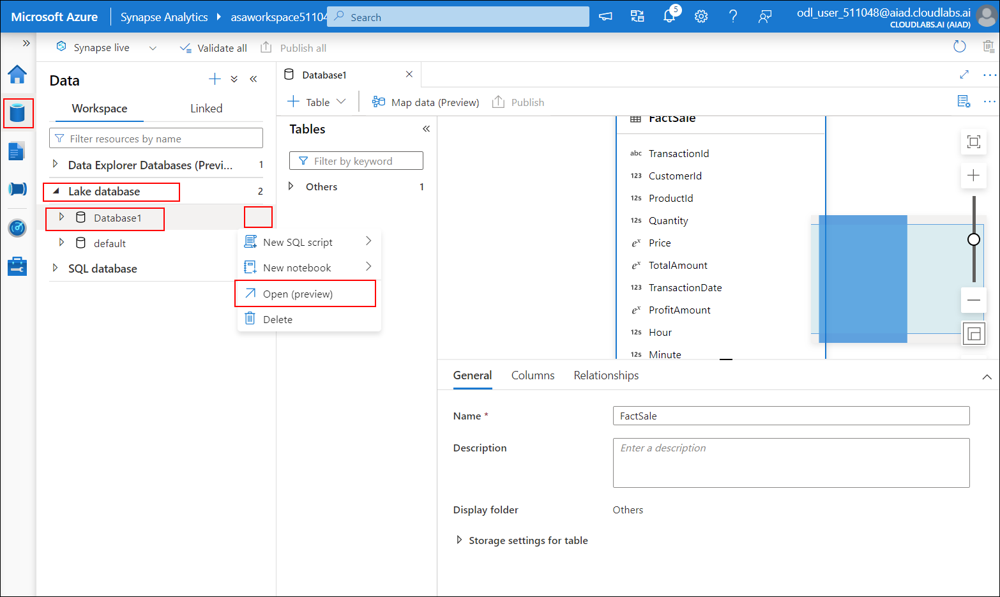

2. In the database editor, select `+ Table` followed by `Custom`. Set the name of the table to `Customer`.

   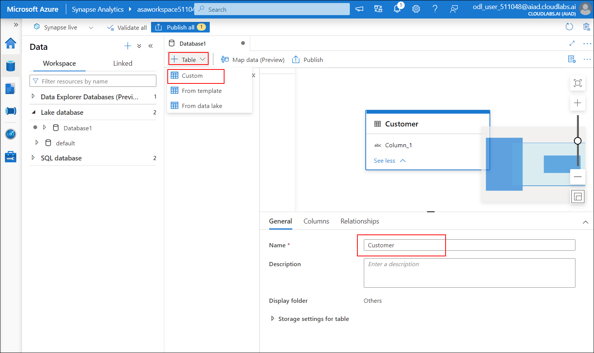

3. In the table editor, select the `Columns` tab, add the following standard columns and then select `Publish`:

    - `CustomerId` (`PK`, type `integer`)
    - `FirstName` (type string)
    - `LastName` (type string)

   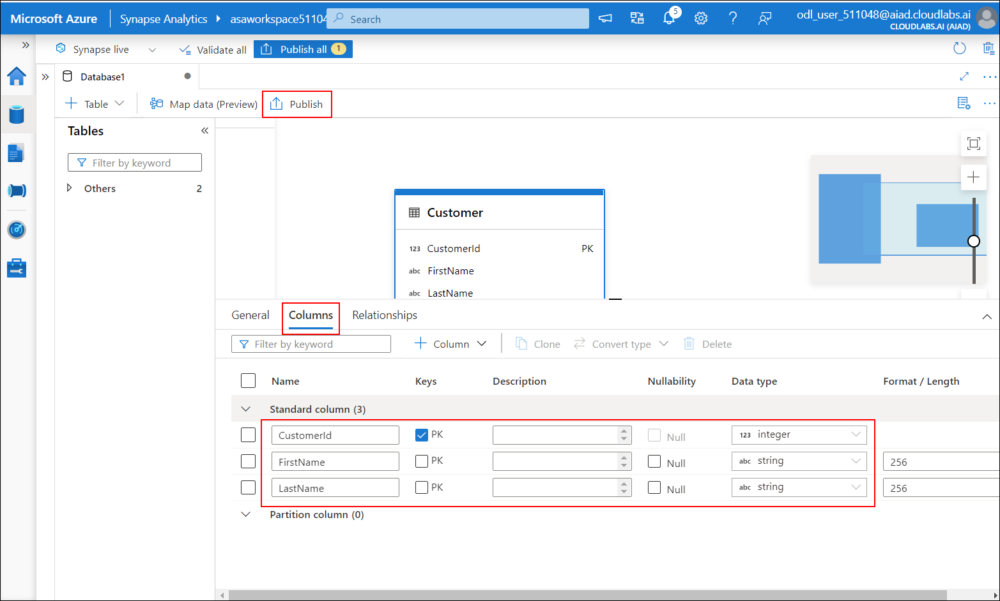

    >IMPORTANT
    >
    >The table must be published before advancing to the next step, otherwise the data flow debug session will not be able to start properly.

4. In the table editor, select `Map data (Preview)` to stard the Map Data tool. If this is the first time you are doing this, you might pe prompted to turn on data flow debug. If this happens, leave the default selections and select `OK` to start the data flow debug session.

   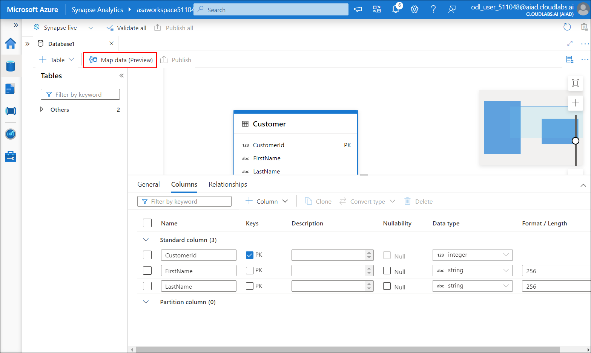

   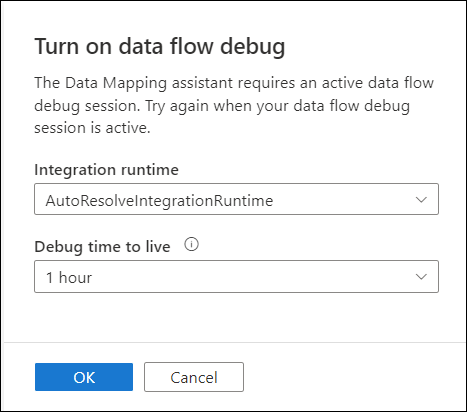
   
   > **Note**: You will have to wait until data debug session is started before proceeding to next steps 

5. In the `New data mapping` dialog, configure the following properties:

   > **Note**: If you can't find the  `New data mapping` dialog, you can find it by clicking on `Map data (Preview)` 
   
    - Source type: `Azure Data Lake Storage Gen2`
    - Source linked service: `asadatalake01`
    - Dataset type: `DelimitedText`
    - Folder path: `database1-staging1`
    - Sources: select the `customer.csv` file

   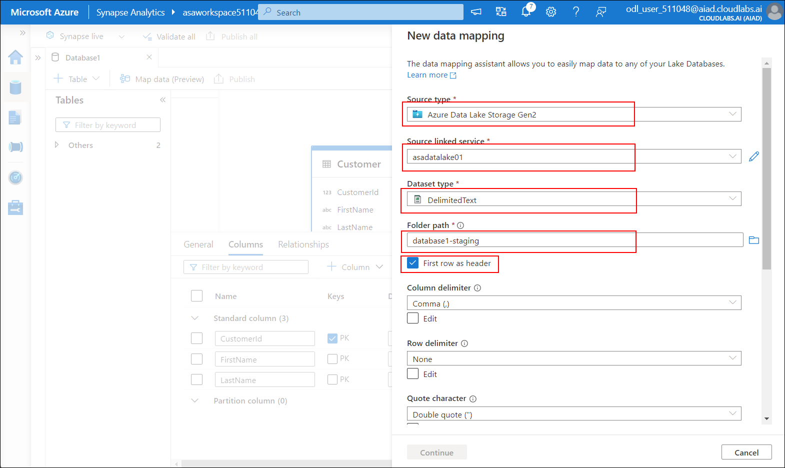

   Select `Continue` to proceed.

   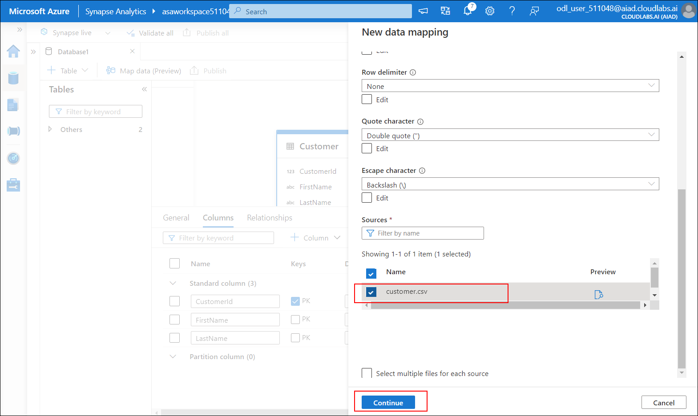

6. Configure the data mapping properties as follows:

    - Data mapping name: `Customer Mapping`
    - Target database: `Database1`

    Select `OK` to finalize the process.

   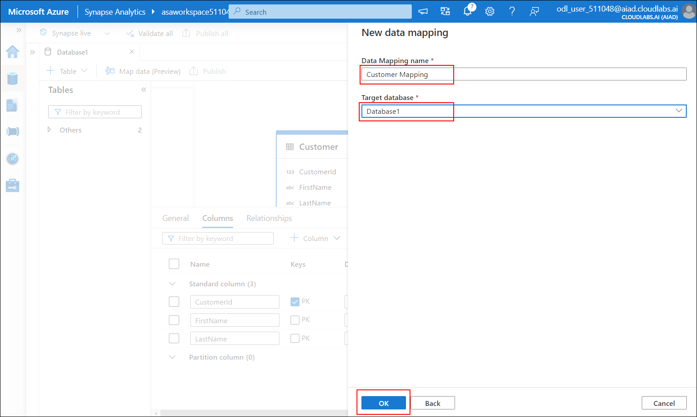

## Task 4 - Create a complex lake database using database templates

In this task you will use a lake database template from the Synapse Knowledge Center to create a complex lake database.

1. In Synapse Studio, navigate to the `Home` hub and then select `Knowledge center`.
  
   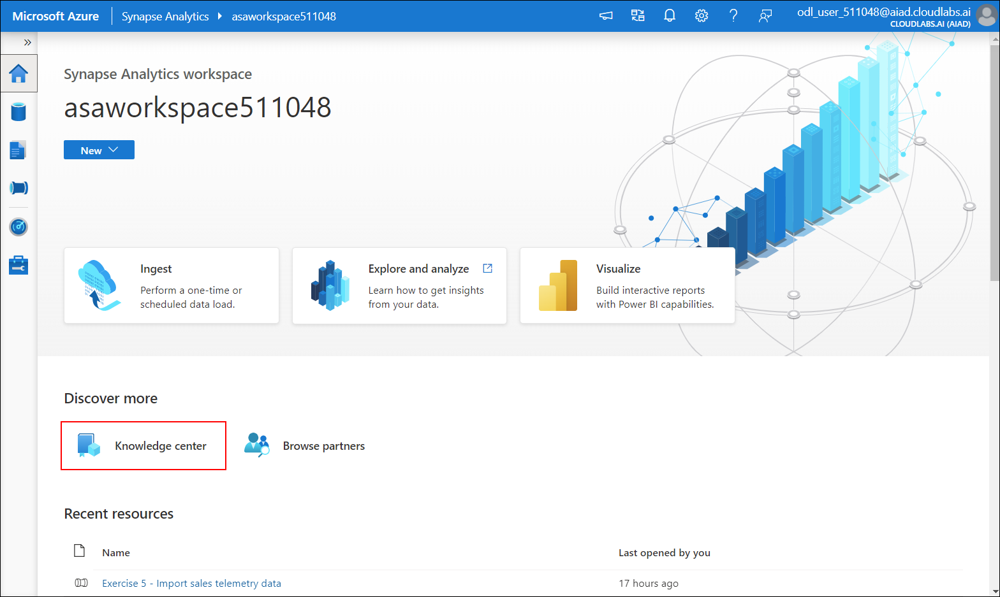

2. In the Knowledge center, select `Browse gallery`.

   

3. In the Gallery, select the `Database templates` tab and then select the `Banking` category.

   

4. Observe the set of tables and then select `Create database` to create a new lake database from the template.

   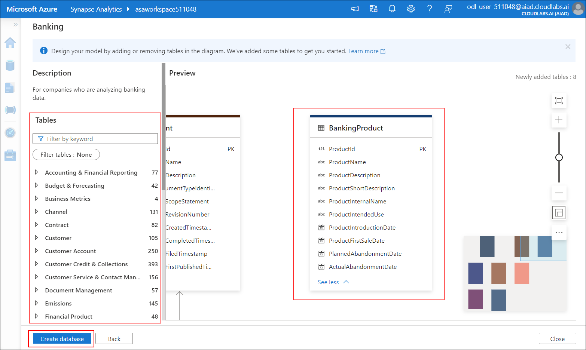

5. In Synapse Studio, open the newly created lake database in the editor and explore its content.

   
