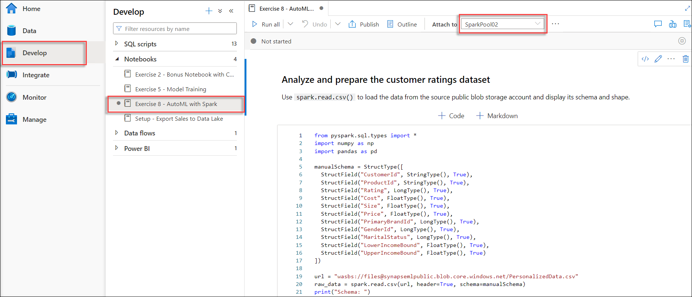
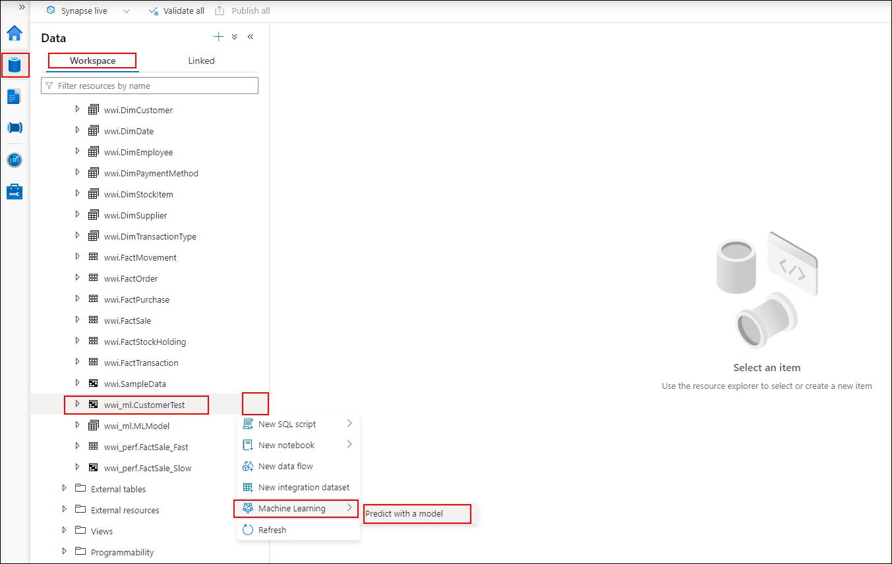
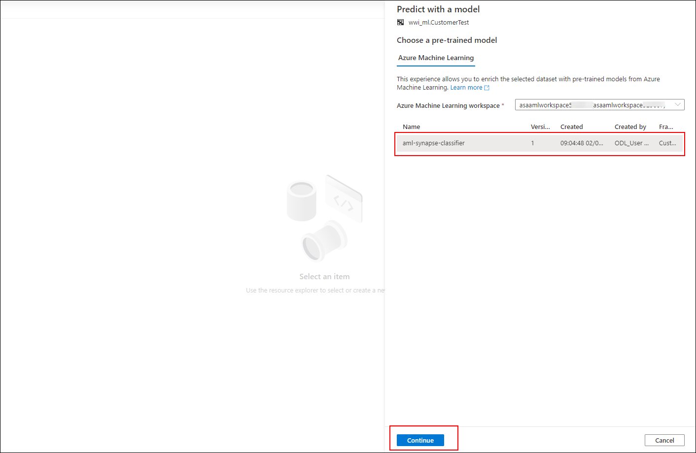
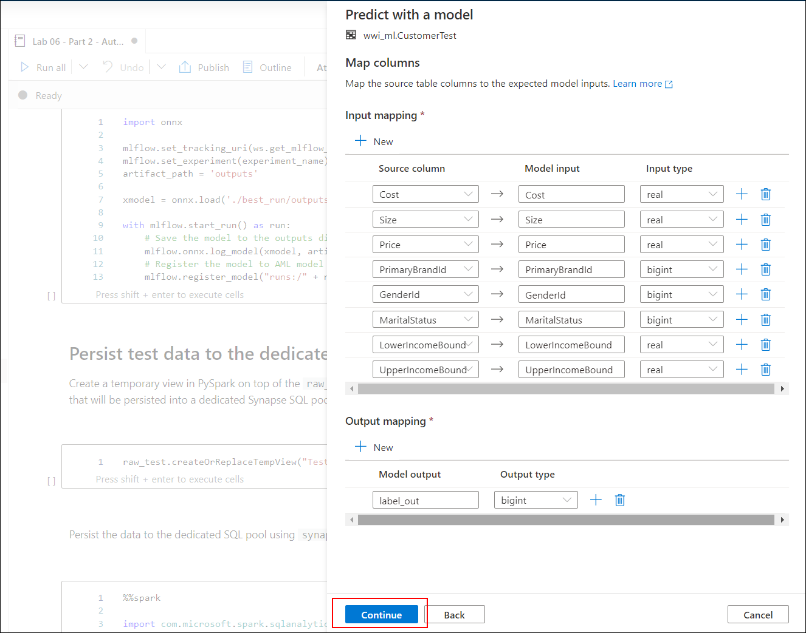
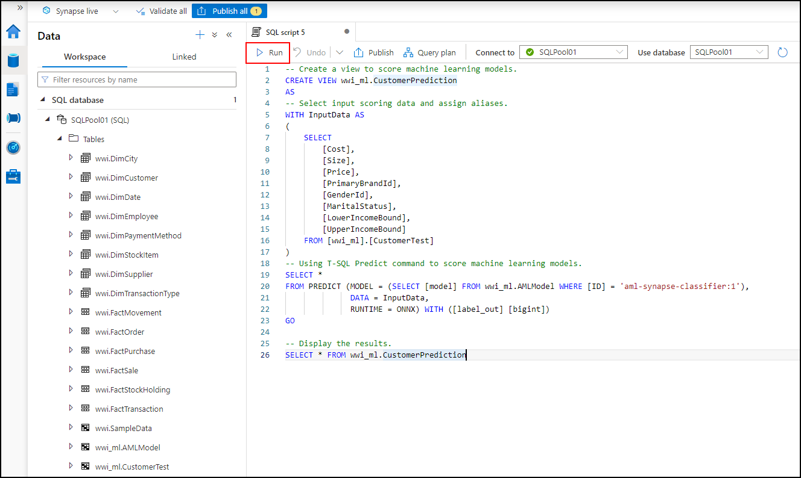
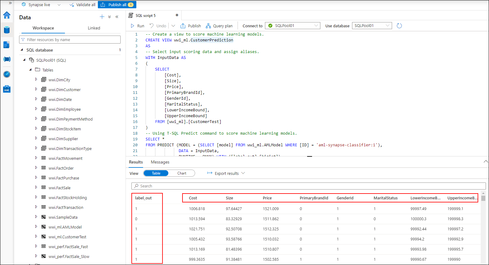

# Exercise 8 - Data Science with Azure Synapse Spark (optional)

Azure Synapse Analytics provides support for using trained models (in ONNX format) directly from dedicated SQL pools. What this means in practice, is that your data engineers can write T-SQL queries that use those models to make predictions against tabular data stored in a SQL Pool database table.

In this exercise, you will train a machine learning model using AutoML with Spark compute. You will use the model registered in Azure Machine Learning to make predictions using the T-SQL `Predict` statement.

For context, the following are the high-level steps taken to create a Spark ML-based model and deploy it, so it is ready for use from T-SQL.

The steps are performed using a combination of data science and data engineering work in Azure Synapse Analytics workspaces:

- Within a Synapse Spark notebook, a data scientist will:

  a. Train a model using Azure Machine Learning automated ML and the Spark pool as local compute. The main requirement is that the model format must be supported by ONNX.

  b. Register the model in the Azure Machine Learning workspace

- To use the model for making predictions in Synapse Analytics, in a SQL Script, a data engineer will:

  a. Use the Azure Machine Learning integration features available in Synapse Analytics Studio to import the ONNX model into a dedicated SQL pool table.

  b. Execute a query using the `FROM PREDICT` statement as you would a table. This statement defines both the model to use and the query to execute that will provide the data used for prediction. You can then take these predictions and insert them into a table for use by downstream analytics applications.

> What is ONNX? [ONNX](https://onnx.ai/) is an acronym for the Open Neural Network eXchange and is an open format built to represent machine learning models, regardless of what frameworks were used to create the model. This enables model portability, as models in the ONNX format can be run using a wide variety of frameworks, tools, runtimes, and platforms. Think of it as a universal file format for machine learning models.

In this exercise, the tasks you will perform are:

- Exercise 8 - Data Science with Spark
  - Task 1 - Training and registering models with AutoML
  - Task 2 - Using registered models in Synapse Analytics

-------------------------------

## Task 1 - Training and registering models with AutoML

1. Open the `Exercise 8 - AutoML with Spark` notebook (located in the `Develop` hub, under `Notebooks` in Synapse Studio). Ensure to select **SparkPool02** and run it step by step to complete this exercise. Some of the most important tasks you will perform are:

- Use Azure Machine Learning AutoML with Synapse Spark compute to train a classification model (the local Spark session of the notebook is used as a compute resource by AutoML)
- Register the ONNX version of the model in the AML model registry using MLFlow
- Persist test data to the dedicated Synapse SQL pool

  
  

Please note that each of these tasks will be addressed through several cells in the notebook.

## Task 2 - Using registered models in Synapse Analytics

>**NOTE**: Successfully completing Task 1 is a prerequisite for this exercise.

In this exercise, you will use the model registered in Exercise 2 to perform predictions using the AML integration features of Synapse Studio.

1. In Synapse Studio, select the `Data` hub, `Workspace` section, `SQLPool01` SQL database, and locate the `wwi_ml.CustomerTest` table.

2. Select the context menu of the table and then select `Machine Learning` -> `Predict with a model`.

    

3. In the `Choose a pre-trained model` dialog, select the highest version of the model named `aml-synapse-classifier` and then select `Continue`.

    

4. Leave the column mappings unchanged and select `Continue`.

    >**NOTE**:
    >
    >The model schema generated with MLFlow and used to register the model enables Synapse Studio to suggest the mappings.

    

5. In the `Store objects in the database` dialog, select the following:

    - Script type: View
    - View name: enter `wwi_ml.CustomerPrediction`
    - Database table: Create new
    - New table: enter `wwi_ml.AMLModel` 

    Select `Deploy model + open script` to continue. Synapse Studio will deploy the model into the `AMLModel` table and create an SQL scoring script for you.

    

6. **Run** the generated SQL script.

    

7. Observe the results of the prediction.

    
