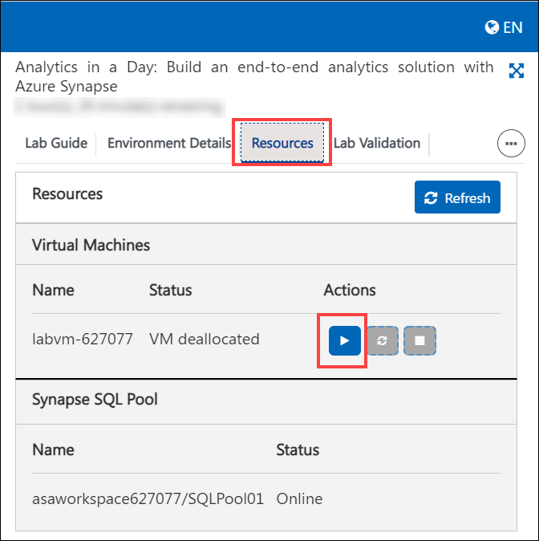

# Hands-On-Lab: SQL Datawarehouse with Syanpse

### How to get started with a provided lab environment

If you are using a hosted lab environment, please follow the steps below to get started:

1. Select the **Lab Environment** tab above the lab guide to copy the Azure credentials used for the lab. Make note of the `UniqueId` value. This value may be referenced at different points during the lab.

    

2. Select **Resources** tab to start the Virtual Machine (VM) provided for this lab. However, you do not need to use the VM to complete the lab. It is there for your convenience to make it easier to sign into Azure if you have an existing account and do not want to log out of it.

    

##  SQL Datawarehouse with Syanpse

In this exercise, you will use a pipeline with parallel activities to bring data into the Data Lake, transform it, and load it into the Azure Synapse SQL Pool. You will also monitor the progress of the associated tasks.

Once data is properly understood and interpreted, moving it to the various destinations where processing steps occur is the next big task. Any modern data platform must provide a seamless experience for all the typical data wrangling actions like extractions, parsing, joining, standardizing, augmenting, cleansing, consolidating, and filtering.

Azure Synapse Analytics provides two significant categories of features - data flows and data orchestrations (implemented as pipelines). They cover the whole range of needs, from design and development to triggering, execution, and monitoring.

